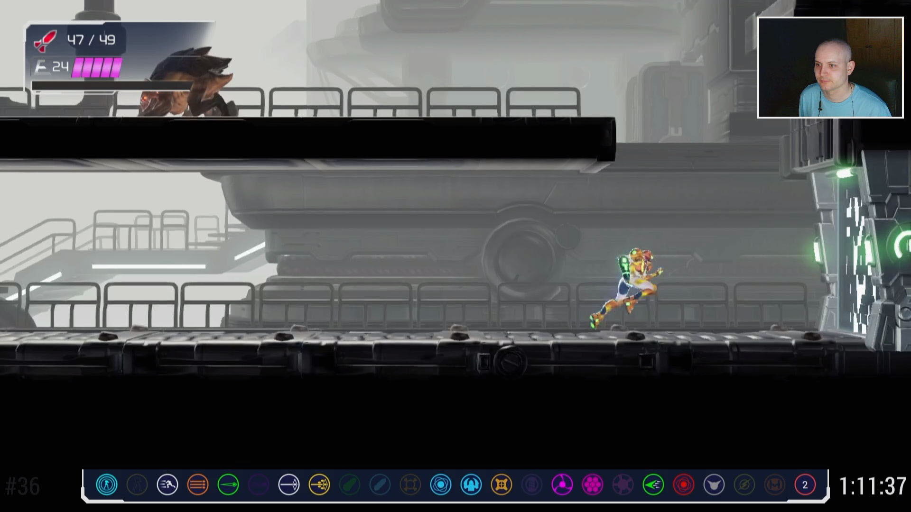
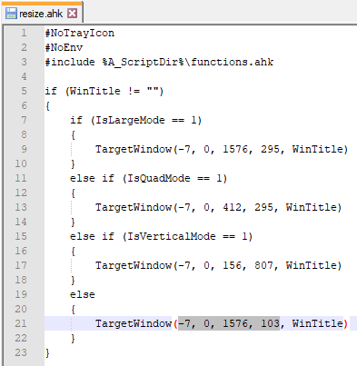

# Overlay graphic

Enhance the appearance of your tracker when recording or streaming with software such as [OBS Studio](https://obsproject.com/).

## Why should anyone use this?

It makes the tracker appear like it's part of the in-game UI. Instead of what seems like a random graphic covering part of the screen, upon first glance you might think it was actually part of the game. In my opinion, small touches like this improve the viewing experience.

## What does it look like?

## Why isn't it built into the tracker?

When window capturing screen elements like this, there is a strong chance that while a colour key filter will remove unwanted parts of the image, it will also affect parts of the image you wanted to keep. This is more common with moving images but also affects still images.

I've had my fair share of frustration when it comes to colour keying unwanted imagery while streaming, so my solution was always to add overlays around the window captured content to ensure the end result is smooth and not missing any content. That's why the overlay is separate from the tracker.

## Should a colour key be used at all?

That is completely up to you.

The tracker does still have a Magenta overflow because correctly sizing the tracker on every existing computer setup is more complicated than providing some values to use. Not everyone will have a perfect window size on first launch, so I've provided 2 methods to help remedy this.

#### Method 1

Manually size the tracker window to roughly the perfect size and then use a colour key filter to strip the remaining overflow. This sounds like a lazy way of doing things but having to resize the window each time means it's actually more effort in the long run.

#### Method 2

Perfectly resize the window with a script. This is the better option but seems to require more effort initially. I've prodived a `window.ahk` script to help move and resize the window and then copy the X,Y,W,H values to the clipboard, ready to paste into the `resize.ahk` script.

## Setting up the sources

Here are the steps I used in OBS Studio. I've included images underneath each step to hopefully make this as clear as possible.

### Step 1
Place your tracker window capture and overlay image into a group. Make sure the overlay source is above the tracker source. Lock both sources but leave the group unlocked for now.

### Step 2
Now you need to crop the title bar from your tracker source. You can do this from the transform window. Add pixels to the **Top** value until you can't see the title bar anymore. On all of the unmodified Windows 10 versions I've tried, this value is normally **31**, but is **27** after tweaking the window metrics. If neither of these values work then you'll need to experiment to find the correct value.

Set the X,Y values on your tracker source to: **10, 0**

Set the Top value on your tracker source to: **31 or 27 or ??**

### Step 3
Add a Colour Correction filter on your group and set the opacity to: **0.8000**

### Step 4
Set the X,Y values on your group to: **170, 990**

## Additional set up

As mentioned earlier, you might need to colour key or resize your tracker window. Here's how to do that.

### Method 1

Add a colour key filter to your tracker source. Set the Key Colour Type to **Magenta**, Similarity to **1**, Smoothness to **1** and that should remove the overflow. Make sure each time you launch the tracker that some of the overflow is showing, otherwise parts of your tracker might not be fully visible on your canvas in OBS Studio.

### Method 2

Launch the `window.ahk` script and a dialog box will pop up with the controls. These are also listed below for your convenience.

- F5 = Select X/Y
- F6 = Select W/H
- F8 = Movement Speed
- F9 = Copy To Clipboard
- Esc = Quit Script
- Arrow Keys = Move / Resize

Move the tracker to an ideal screen position with your mouse. Now use your arrow keys to position the window more accurately. If you want the movement steps to be larger then press F8 to switch between 1 pixel and 10 pixels per key press.

When you're happy with the position, press F6 to switch to width and height mode. Use your arrow keys to resize the width, leaving none of the Magenta overflow visible. Do the same again with the height and you should end up with a perfectly sized tracker window.

To complete this process, press F9 and the X,Y,W,H values will be copied to the clipboard. These values will also be shown in a dialog box.

Press Esc key to quit the script. Paste your tracker window value into the `resize.ahk` script and then save it.

## Notes

The tracker and overlay should be grouped in order for them to display as intended. After locking both of the sources you can move the group without disturbing the size and position values. My canvas is set to 1920x1080 pixels. If your canvas is a different size then you might need to scale the group and center it afterwards. Right click on your group and then go to `Transform > Center Horizontally` to properly align it.

This overlay is not compatible with the double row variant, only the normal sized tracker. The double row variant wasn't intended to be used in a video capture session, it's for people who have trouble seeing the smaller icons and don't care about recording or streaming their runs.
