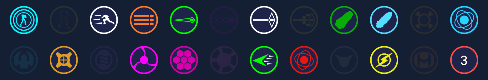
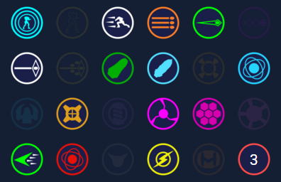
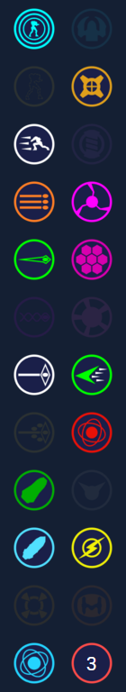

# MDR Item Tracker

Track your item pickups during Metroid Dread Randomizer runs.

## What is this?

It's a heavily cut down version of the ALTTP randomizer [Item Tracker](https://github.com/crossproduct42/alttprandohelper) by CrossProduct & HalfARebel, adapted for use during randomizer runs on Metroid Dread. Almost all of their code was removed, except basic item pickup logic.

Icons were extracted from [Open Dread Rando](https://github.com/randovania/open-dread-rando) and scaled to 64x64 pixels. The original 128x128 pixel icons have also been included for use with a larger double row variant of the tracker. Open Dread Rando is part of [Randovania](https://github.com/randovania/randovania).

## Regular: Single Row

## Large: Double Row

## Regular: Quad Row

## Regular: Vertical

## Requirements

#### &bull; Google Chrome

The tracker was designed to be launched in Google Chrome. Other browsers should work fine but I chose Chrome because pages can easily be launched in App mode, which removes most functionality like tabs, address bar etc. to focus purely on the page content. This is useful when recording or streaming because screen space is limited.

#### &bull; AutoHotkey
The tracker launches in a large window and after a short delay, the resize script should then run. The resize script requires [AutoHotkey](https://www.autohotkey.com/) to be installed. If you don't want to use AutoHotkey then you could instead use another tool such as [DisplayFusion](https://www.displayfusion.com/) (pro version) to auto size the window.

## How to launch

#### Regular: Single Row
Run the `MDR_Item_Tracker.bat` file.

#### Large: Double Row
Run the `MDR_Item_Tracker_Large.bat` file.

#### Regular: Quad Row
Run the `MDR_Item_Tracker_Quad.bat` file.

#### Regular: Vertical
Run the `MDR_Item_Tracker_Vertical.bat` file.

## Overlay graphic

There's an extra graphic in the overlay folder if you want the tracker to match Metroid Dread's UI while recording or streaming. This is only for the regular sized tracker and not the other variants. You can read more about this and how to set it up on the [overlay help page](OVERLAY.md).

## Notes

Click items to toggle them. Left click the Metroid DNA counter to increase it and right click to decrease it.

Change the X,Y,W,H values in the resize script to customise the position or size after launching. There is another script included called `window.ahk` that can help you do this with pixel perfect accuracy, using your arrow keys.

Pulse radar is automatically toggled by default. You can add more auto toggles in the `data\tracker.js` file.

## History

[View the project history](HISTORY.md)

## Contact

If you've found something wrong with the tracker or if you have a suggestion then feel free to contact me.

You can sometimes catch me live on [Twitch](https://www.twitch.tv/DesertEagleDerek), otherwise DM me on [Twitter](https://twitter.com/DerekDeagle) or [Discord](https://discord.gg/ZpPvbaw).
